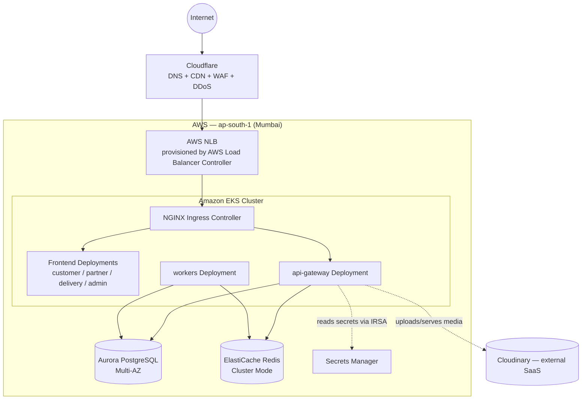
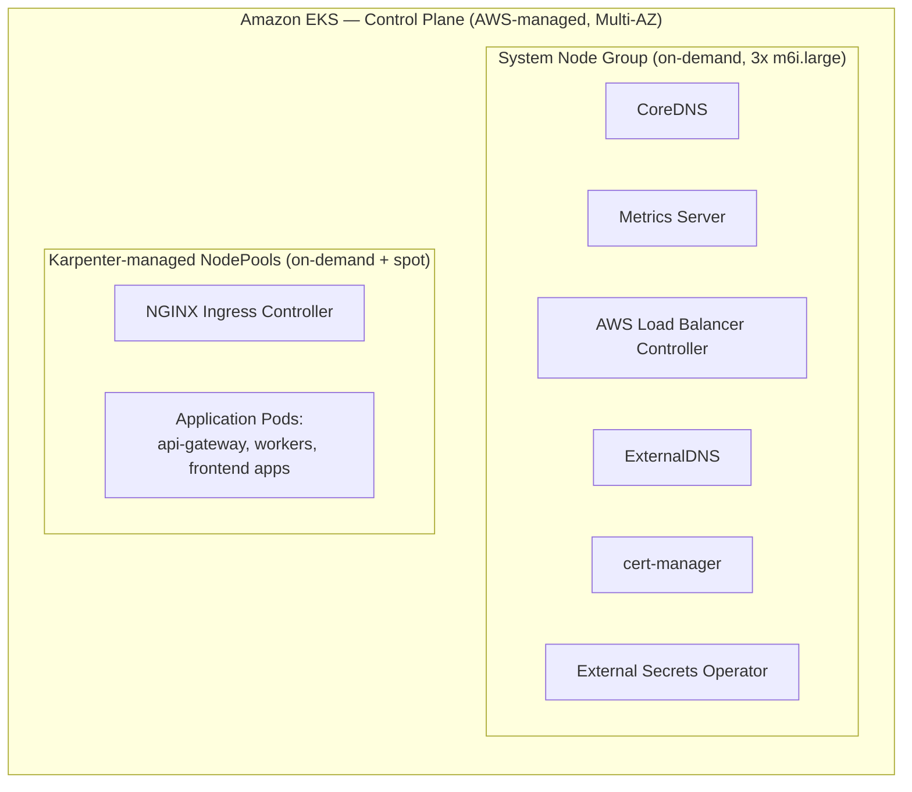
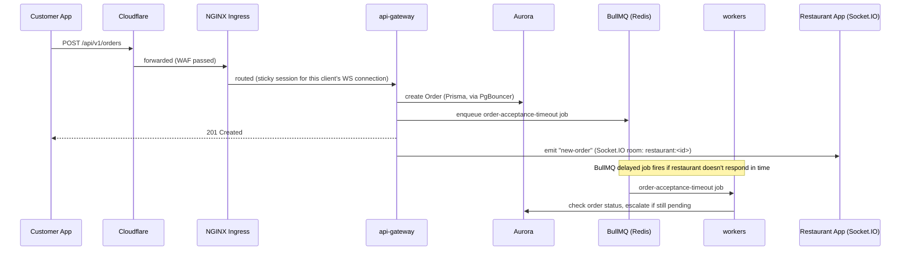
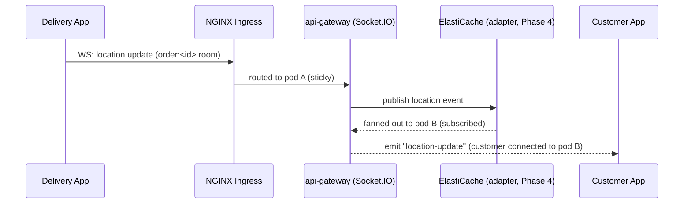
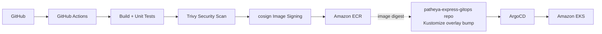
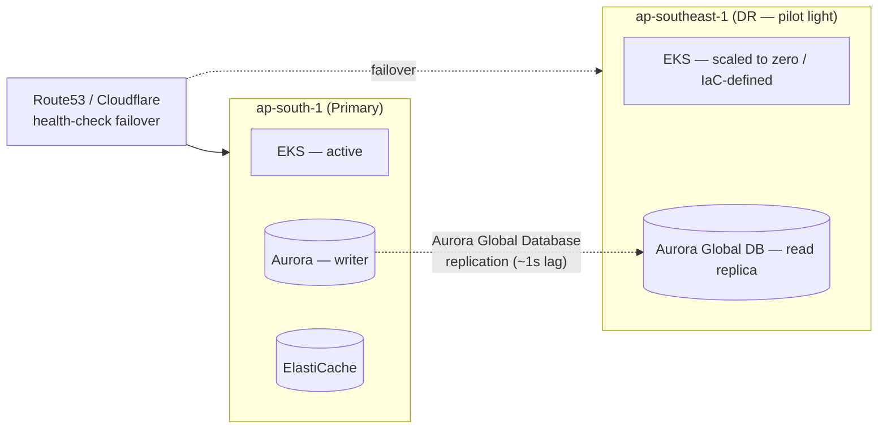

# Patheya Express — Enterprise Cloud Architecture Blueprint

**Status:** Master reference document. Documentation only — no Terraform, no Kubernetes manifests,
no source changes, nothing deployed. Every phase from Phase 2 onward implements a slice of this
document; this document itself is not an implementation plan for a single phase.

**Audience:** Cloud/platform architects, SRE, security engineering, and every engineering team
whose service this document places on the platform.

**Baseline this document builds on:**

| Repository | Status | What already exists |
| --- | --- | --- |
| Frontend (Nx workspace, Angular 21) | Phase 0 + 1 complete | 4 apps (Customer, Partner/Restaurant, Delivery, Admin), shared libs (`auth`, `api-sdk`, `shared-ui`, `core`, `shared-models`), each app containerized behind nginx with a health-checked Docker image |
| Backend (NestJS/Prisma/PostgreSQL/Redis/BullMQ/Socket.IO) | Phase 1A complete | Hardened multi-stage Dockerfile (non-root, tini, `readOnlyRootFilesystem`-ready), `/api/v1/health/{live,ready}` contract, structured JSON logging, graceful shutdown, Kustomize `k8s/` (base + `development`/`staging`/`production` overlays) covering Deployments, Services, HPA, PDB, NetworkPolicy, PriorityClass, least-privilege ServiceAccounts, Ingress with Socket.IO sticky-session affinity |

Phase 1A's own audit (`docs/infrastructure/README.md`) surfaced gaps this blueprint explicitly
schedules rather than ignores: no Redis adapter for Socket.IO (cross-pod fanout), workers share a
process with the HTTP app (no standalone worker entrypoint), `KAFKA_BROKER` is a required-but-unused
env var, and production secrets are still Kustomize placeholders. Each is addressed in a named
section below with a phase assignment, not left implicit.

---

## Executive Summary

Patheya Express is a two-repository food-delivery platform (Angular frontend, NestJS backend)
already built to be container-native and Kubernetes-ready. This document defines the single shared
AWS platform both repositories deploy onto: one AWS Organization, a primary region in Mumbai
(`ap-south-1`) with a warm-standby DR region in Singapore (`ap-southeast-1`), one Amazon EKS
cluster per environment, Aurora PostgreSQL and ElastiCache Redis as the managed data layer,
Cloudflare as the public edge, and GitOps (GitHub Actions → ECR → ArgoCD) as the only path to
production. It is designed to carry the platform from today's development-scale traffic through
100,000+ concurrent users without a re-architecture, and names the specific changes required to
reach 1,000,000.

## Architecture Goals

1. **One platform, two repositories.** Frontend and backend deploy independently but share
   networking, identity, secrets, observability, and CI/CD tooling — no per-repo bespoke infra.
2. **GitOps-only production changes.** No `kubectl apply` from a laptop against `prod`, ever —
   enforced by RBAC, not just convention.
3. **Least privilege by default.** Continues Phase 1A's stance (zero-grant ServiceAccounts for
   workloads that don't call AWS/K8s APIs) up through IAM — nothing gets broad permissions because
   asking for narrow ones was inconvenient.
4. **Every environment is the same shape.** `development`/`staging`/`production` differ in scale
   and data, never in topology — what passes staging is structurally what runs in production.
5. **No irreversible defaults.** Every stateful choice (database engine, cache, image registry) has
   a documented exit path; see the Architecture Decision Records (Section 16).

## Non-functional Requirements

### Scalability Goals

| Tier | Concurrent users | Order throughput (peak) | Primary bottleneck to watch |
| --- | --- | --- | --- |
| Launch | 10,000 | ~50 orders/min | Aurora connection count (mitigated by PgBouncer, Section 5) |
| Growth | 50,000–100,000 | ~400 orders/min | EKS node scaling latency, Socket.IO fanout (Section 6) |
| Scale | 250,000–500,000 | ~1,500 orders/min | Aurora write throughput, single-region blast radius |
| National | 1,000,000 | ~4,000 orders/min | Single-region ceiling — requires multi-region active-active (Section 15) |

### Availability Goals

- **API Gateway:** 99.9% monthly uptime SLO (≈43 minutes/month error budget).
- **Order creation path** (customer → restaurant → payment): 99.95% — the one flow that directly
  loses revenue when it fails.
- **Realtime tracking (Socket.IO):** 99.5% — degraded realtime (client falls back to REST polling,
  a frontend-side capability already assumed) is acceptable; a full outage is not.
- **Planned maintenance:** zero customer-visible downtime for routine deploys (rolling updates,
  already `maxUnavailable: 0` in Phase 1A's Deployments); scheduled maintenance windows only for
  major Aurora engine version upgrades.

### Security Goals

Least-privilege IAM/RBAC everywhere, encryption at rest and in transit for every data store, no
long-lived static credentials anywhere in CI/CD or in-cluster (OIDC/IRSA only), every container
image scanned and signed before it can run in `production`, and a documented, tested incident
response path (Section 12 ties into this).

### Disaster Recovery Goals

RPO ≤ 5 minutes for the primary datastore (Aurora), RTO ≤ 60 minutes for a full regional failover
at current scale (tightening as the platform grows — see Section 12 and Section 13's growth table).

## Deployment Strategy

GitOps via ArgoCD, one Git repository (`patheya-express-gitops`, new — separate from both
application repositories) holding environment-parameterized Kustomize overlays descended directly
from Phase 1A's `k8s/` structure. Progressive delivery (canary/blue-green) via Argo Rollouts for
the backend `api-gateway` Deployment; standard rolling updates for `workers` (no external traffic,
canary analysis wouldn't observe anything a rolling update doesn't already cover) and frontend
apps.

## Operational Strategy

Platform engineering owns EKS, networking, and shared add-ons (Karpenter, cert-manager,
ExternalDNS, ALB Controller, External Secrets, observability stack). Each application team owns
their own namespace's workloads, resource requests/limits, and alert thresholds within guardrails
(Kyverno policies, ResourceQuotas) platform engineering sets. On-call rotation covers platform +
backend together at launch scale; frontend, being static-asset-served, escalates through platform
on-call rather than carrying its own rotation until traffic justifies it.

---

## Section 1 — High-Level Architecture

Traffic never reaches AWS without passing Cloudflare first (DNS resolution + edge WAF/DDoS
scrubbing + static-asset CDN caching). Cloudflare's origin is a single AWS Network Load Balancer
per environment, provisioned by the AWS Load Balancer Controller and pointed at the in-cluster
NGINX Ingress Controller — this is a deliberate choice (see ADR, Section 16) that lets Phase 1A's
existing `nginx.ingress.kubernetes.io/*` annotations (including the Socket.IO sticky-session
affinity) carry forward unchanged into the AWS environment rather than being rewritten for
ALB-native ingress semantics.

## Section 2 — AWS Architecture

### Account structure

AWS Organizations, one Landing Zone (AWS Control Tower), accounts:

| Account | Purpose |
| --- | --- |
| `patheya-management` | Organization root, billing consolidation, SCPs |
| `patheya-security` | Centralized GuardDuty, Security Hub, Config, CloudTrail org-trail aggregation |
| `patheya-shared-services` | ECR (shared image registry), Route53 public hosted zone delegation, CI/CD runners |
| `patheya-dev` | Development EKS cluster + data stores |
| `patheya-staging` | Staging EKS cluster + data stores |
| `patheya-prod` | Production EKS cluster + data stores |
| `patheya-dr` | Warm-standby DR resources in `ap-southeast-1` (Section 12) |

Cross-account access via IAM roles + AWS SSO (IAM Identity Center) — no IAM users, no long-lived
access keys for humans.

### Regions and Availability Zones

- **Primary:** `ap-south-1` (Mumbai) — closest region to the primary user base (Razorpay, the
  platform's only payment gateway today, is India-only, which is the deciding factor here).
- **DR:** `ap-southeast-1` (Singapore) — nearest AWS region with full service parity and Aurora
  Global Database support from `ap-south-1`.
- Every environment spans 3 Availability Zones (`ap-south-1a/1b/1c`) — 2 AZs is the documented
  minimum for Aurora Multi-AZ, but 3 is required for the EKS control plane's own HA guarantees and
  for `topologySpreadConstraints` (already present in Phase 1A's Deployments) to spread pods
  meaningfully.

### VPC design (production)

| Attribute | Value |
| --- | --- |
| VPC CIDR | `10.30.0.0/16` (staging `10.20.0.0/16`, dev `10.10.0.0/16` — non-overlapping, peerable if ever needed) |
| Public subnets | `10.30.0.0/24`, `10.30.1.0/24`, `10.30.2.0/24` (one per AZ) — NLB + NAT Gateway ENIs only |
| Private application subnets | `10.30.16.0/20`, `10.30.32.0/20`, `10.30.48.0/20` (one per AZ) — EKS worker nodes |
| Private data subnets | `10.30.64.0/24`, `10.30.65.0/24`, `10.30.66.0/24` (one per AZ) — Aurora, ElastiCache only |
| Internet Gateway | one, attached to the VPC, routed from public subnets only |
| NAT Gateways | one per AZ (3 total) — avoids a cross-AZ data-transfer bill and a single-AZ NAT outage taking down egress for the whole cluster |

Route tables: public subnets route `0.0.0.0/0` → Internet Gateway; each private application subnet
routes `0.0.0.0/0` → its own AZ's NAT Gateway (not a shared one — keeps NAT failure blast radius to
one AZ); private data subnets have **no default route at all** — Aurora/ElastiCache are reachable
only from inside the VPC, full stop.

Security Groups (stateful, primary enforcement layer):

| SG | Ingress | Egress |
| --- | --- | --- |
| `nlb-sg` | 443 from `0.0.0.0/0`* | to `eks-node-sg` only |
| `eks-node-sg` | from `nlb-sg` (NGINX NodePort range) + node-to-node (CNI) | to `aurora-sg`, `redis-sg`, `443` to internet (via NAT, for Cloudinary/Razorpay/ECR/SMTP) |
| `aurora-sg` | 5432 from `eks-node-sg` only | none needed |
| `redis-sg` | 6379 from `eks-node-sg` only | none needed |

*In practice Cloudflare's IP ranges only, kept current via a scheduled Lambda that syncs
Cloudflare's published IP list into the security group — not a literal `0.0.0.0/0` in the deployed
configuration.

Network ACLs (stateless, defense-in-depth on top of Security Groups): default-deny at the data
subnet boundary, explicitly allowing only the Aurora/Redis ports from the application subnet CIDR
ranges. Security Groups do the real work; NACLs exist to contain a Security-Group misconfiguration,
not as the primary control.

### DNS and edge

- **Route53**: public hosted zone `patheyaexpress.com`, delegated as an authoritative nameserver
  set that Cloudflare's DNS actually fronts (Cloudflare is the resolver-facing DNS; Route53's zone
  exists for AWS-internal record management — ExternalDNS writes Ingress-derived records here,
  and a Cloudflare-side sync, or Cloudflare-as-registrar-and-DNS directly, keeps the public-facing
  records in sync). Private hosted zone `internal.patheyaexpress.com` for service discovery that
  needs to cross VPC boundaries (rare — most service discovery is in-cluster DNS via CoreDNS).
- **Cloudflare**: authoritative public DNS, CDN (caches frontend static assets and Cloudinary-proxied
  images at Cloudflare's edge, not just AWS's), WAF (OWASP core rule set + custom rules for the
  `/api/v1/*` path), rate limiting at the edge (a second layer above the in-app `ThrottlerModule`
  Phase 1A's backend already runs), and DDoS mitigation (L3/L4 automatic, L7 via WAF rules).
- **ACM**: certificates for the AWS-side NLB/ALB listeners, DNS-validated, auto-renewing. Cloudflare
  holds the customer-facing certificate for `patheyaexpress.com`; ACM's certificate covers the
  Cloudflare→AWS origin hop (Cloudflare "Full (strict)" SSL mode — encrypted and validated on both
  hops, never a plaintext or unverified segment).
- **CloudFront**: not in the request path for API traffic (Cloudflare already does that job) —
  reserved specifically for the future S3-backed static asset path (Section 7) if/when Cloudinary
  is supplemented or replaced.

## Section 3 — Container Platform

- **Amazon EKS**: one cluster per environment, control plane version pinned to the latest AWS-supported
  minor version minus one (N-1) — never bleeding-edge on a managed control plane, never more than
  one version behind to avoid a forced multi-version jump at end-of-support.
- **Namespaces**: `platform` (shared add-ons), `patheya-backend` (api-gateway, workers — direct
  continuation of Phase 1A's `patheya-express`/`patheya-express-staging`/`patheya-express-dev`
  naming, just renamed for a two-repo world), `patheya-frontend` (the 4 Angular app Deployments).
  Kept separate from backend so a frontend rollout's `ResourceQuota` and RBAC never intersect with
  backend's.
- **Ingress**: NGINX Ingress Controller (in-cluster) is the single entry point for all HTTP(S) and
  WebSocket traffic — reuses Phase 1A's Ingress manifests, including the cookie-based session
  affinity that mitigates Socket.IO's lack of a Redis adapter (Section 6 schedules the real fix).
- **AWS Load Balancer Controller**: provisions exactly one internet-facing NLB per environment,
  targeting the NGINX Ingress Controller's Service — not one ALB per Ingress resource (which would
  fragment TLS termination and undo the single-entry-point design).
- **Karpenter**: replaces the Cluster Autoscaler. Two NodePools:
  - `general-purpose` — on-demand baseline (`m6i.xlarge`/`m6a.xlarge`) sized to always cover the
    HPA `minReplicas` floor for every Deployment, so a spot interruption storm can never take the
    platform below its documented minimum capacity.
  - `general-purpose-spot` — spot instances across `m6i`/`m6a`/`m5`/`m5a` families (diversified to
    reduce simultaneous-interruption risk), absorbing everything above the on-demand floor. Phase
    1A's PodDisruptionBudgets apply unchanged here — they're exactly what makes spot interruption
    safe for `api-gateway`/`workers` today.
- **Metrics Server**: required for the HPA resource metrics Phase 1A's `api-gateway`/`workers`
  HPAs already consume — no behavior change, just the piece that was implicitly assumed present.
- **ExternalDNS**: watches Ingress `host` fields (already set per-overlay in Phase 1A) and manages
  the corresponding Route53 records automatically — no manual DNS changes on every deploy.
- **cert-manager**: issues/renews the ACM-equivalent-but-cluster-managed certificates for any
  in-cluster TLS needs beyond the NLB's ACM listener (mTLS between services, if adopted later).
- **External Secrets Operator**: syncs AWS Secrets Manager entries into Kubernetes `Secret` objects
  shaped exactly like Phase 1A's `secretGenerator`-produced Secret — replacing the placeholder
  `secret.env.example` file with real, rotatable, audited secret material. This is the direct
  resolution of the "production secrets are still placeholders" risk Phase 1A's audit flagged.
- **RBAC**: platform-engineering-only `ClusterRoleBinding`s for cluster-scoped resources
  (NodePools, PriorityClasses); each application namespace gets a scoped `RoleBinding` for its own
  team via AWS SSO group mapping (`aws-auth` ConfigMap / EKS access entries). Application
  ServiceAccounts (`api-gateway`, `worker`) keep Phase 1A's zero-grant posture — nothing changes
  there, because nothing about moving to AWS gives those workloads a reason to call the Kubernetes
  or AWS APIs.
- **Network Policies**: Phase 1A's default-deny-plus-explicit-allow base ships unchanged; the
  previously-open "external egress" rule (Postgres/Redis/Cloudinary/Razorpay/SMTP addressing was
  unknown at the time) gets tightened now that real, known CIDRs/security-group-references exist —
  restricted to the VPC's Aurora/Redis subnets plus HTTPS-only internet egress for the SaaS
  dependencies (Cloudinary, Razorpay, SMTP provider).
- **Priority Classes**: Phase 1A's `patheya-express-critical`/`patheya-express-standard` carry
  forward unchanged, joined by a new `platform-critical` (above both) for cluster add-ons
  (ALB Controller, CoreDNS, ExternalDNS) that every other workload depends on.

## Section 4 — Application Deployment

### Frontend repository

Each of the 4 Angular apps (Customer, Partner, Delivery, Admin) builds to static assets served by
an nginx container (the same pattern already running today — see the existing
`docker-customer-app`/`docker-partner-app`/`docker-delivery-app`/`docker-admin-app` images).

| Aspect | Design |
| --- | --- |
| Deployment | One `Deployment` per app, `namespace: patheya-frontend`, `RollingUpdate` (`maxUnavailable: 0`, matching the backend's already-proven pattern) |
| Service | ClusterIP, one per app |
| Ingress | Single shared `Ingress` resource, path- or host-based routing per app (`app.patheyaexpress.com`, `partner.patheyaexpress.com`, `delivery.patheyaexpress.com`, `admin.patheyaexpress.com`) — all still behind the one NLB/NGINX entry point from Section 1 |
| Scaling | HPA on CPU only (static asset serving is cheap and stateless — memory pressure isn't a realistic scaling trigger here); `minReplicas: 2` per app in production for zero-downtime rolling updates |
| Namespace | `patheya-frontend`, isolated `ResourceQuota` from `patheya-backend` |

### Backend repository

Reuses Phase 1A's topology directly:

- **api-gateway** — HTTP + WebSocket entry point, `Service` + `Ingress`-attached, HPA on
  CPU+memory, PDB `minAvailable`, own PriorityClass (`patheya-express-critical`).
- **workers** — same container image as `api-gateway` (Phase 1A's documented, deliberate choice —
  see `docs/infrastructure/workers.md`), independent HPA/PDB/ServiceAccount, **not** attached to
  any Service or Ingress. Phase 1A flagged this as a known limitation (no true process isolation);
  **this blueprint schedules the real fix in Phase 4** (a dedicated `worker-main.ts`
  `NestFactory.createApplicationContext()` entrypoint, application-code work now properly resourced
  as a named phase deliverable rather than a deferred footnote).
- **Socket.IO** — Phase 1A's sticky-session mitigation carries forward at the Ingress layer, but
  **Phase 4 also adds the `@socket.io/redis-adapter`**, wired to the same ElastiCache Redis cluster
  Section 6 defines, closing the cross-pod fanout gap for real rather than continuing to paper over
  it with session affinity alone.
- **Rolling updates**: unchanged from Phase 1A (`maxUnavailable: 0`) for routine deploys.
- **Blue/Green and Canary**: introduced via **Argo Rollouts** (Section 9) for `api-gateway` only —
  traffic-shifted canary (weighted NGINX routing, automated promotion/rollback gated on Prometheus
  success-rate and latency queries). `workers` stays on plain rolling updates: it receives no
  external traffic, so canary analysis has nothing meaningful to observe that a health-check-gated
  rolling update doesn't already cover.
- **Namespaces**: `patheya-backend`, environment-suffixed per cluster (dev/staging clusters each
  have their own `patheya-backend`; production's is just `patheya-backend` in the `patheya-prod`
  account) — same rename rationale as the frontend's namespace.

## Section 5 — Database Architecture

**Amazon Aurora PostgreSQL** (Aurora, not vanilla RDS Postgres — see ADR, Section 16), same
Prisma-generated schema Phase 1A already ships against.

| Component | Design |
| --- | --- |
| Engine | Aurora PostgreSQL 16.x (matches the schema's current Postgres 16 target) |
| Topology | 1 writer + 2 reader instances, one per AZ |
| Instance class (production) | `db.r6g.xlarge` writer, `db.r6g.large` readers (scale-up path to `db.r6g.2xlarge` at the "Scale" tier — Section 13) |
| Instance class (dev/staging) | Aurora Serverless v2, 0.5–4 ACUs — scales toward zero between test runs, no idle full-instance cost |
| Connection pooling | **PgBouncer**, deployed as its own in-cluster Deployment (transaction pooling mode) sitting between every Prisma client and the Aurora writer endpoint. Necessary: Prisma's own connection pool is per-pod-instance, and at `api-gateway`'s HPA ceiling (10 pods in Phase 1A's base config) plus `workers`, naive per-pod Postgres connections would approach Aurora's `max_connections` ceiling well before compute is actually the bottleneck. Read-only Prisma queries route to a second PgBouncer pool targeting the Aurora reader endpoint. |
| Backups | Automated daily snapshots, 35-day retention (Aurora's maximum), continuous backup for point-in-time recovery to any second within that window |
| Cross-region | Nightly snapshot copy to `ap-southeast-1` (DR account) — see Section 12 for how this becomes an Aurora Global Database read replica once DR moves from pilot-light to warm-standby |
| Encryption | KMS customer-managed key, at rest; TLS enforced (`rds.force_ssl=1`) in transit — Prisma's `DATABASE_URL` includes `sslmode=require` |
| Scaling strategy | Vertical (instance class step-up) first, since Aurora write scaling is inherently vertical; horizontal read scaling via additional reader instances as read-heavy endpoints (menu browsing, restaurant search) grow disproportionately to writes |

## Section 6 — Caching

**Amazon ElastiCache for Redis**, cluster mode enabled.

| Environment | Topology |
| --- | --- |
| Production | 3 shards, each 1 primary + 1 replica, Multi-AZ automatic failover, `cache.r6g.large` nodes |
| Staging | 1 shard, 1 primary + 1 replica |
| Development | 1 shard, single node (no replica — dev doesn't need failover, just needs to exist) |

**What runs on it** (all direct continuations of what Phase 1A's `RedisService`/`QueueService`
already assume a single Redis endpoint for):

- **BullMQ** — all 6 existing queues (`notifications`, `dispatch`, `payments`, `search`, `tickets`,
  `orders`) point at the ElastiCache cluster endpoint; no code change, only a connection-string
  change (`REDIS_HOST`/`REDIS_PORT` → the ElastiCache configuration endpoint, already how Phase
  1A's ConfigMap/Secret split expects it to be supplied).
- **Socket.IO adapter** — `@socket.io/redis-adapter`, added in Phase 4 (Section 4), pub/sub against
  this same cluster.
- **Distributed locks** — Redlock-pattern locks for the narrow set of genuine race conditions in
  the order flow (e.g., two delivery partners accepting the same dispatch assignment
  simultaneously) — a new, small addition scoped to Phase 4 alongside the Redis adapter work, not
  retrofitted piecemeal.
- **Presence/tracking cache** — existing `RedisService.set/get` usage for delivery-partner presence
  and live location, unchanged.

**Cache strategy**: cache-aside for read-heavy, slowly-changing data (restaurant/menu listings) —
read from Redis, fall through to Aurora on miss, write-through skipped as unnecessary complexity for
data that tolerates a short TTL-bounded staleness window (60–300s depending on endpoint). Session/
auth token data is not cached in Redis at all — JWT verification is stateless by design (Phase 1A's
existing `JwtService` pattern), so there's no session store to invalidate or scale.

## Section 7 — Storage

**Cloudinary remains the primary media store** — no change to the current architecture. The
`StorageProvider` interface Phase 1A's audit documented (`upload`/`replace`/`delete`/`exists`/
`getUrl`/`checkHealth`) is precisely the seam that makes this a config decision, not a code
decision: an `S3StorageProvider` implementing the same interface is a drop-in addition whenever
it's needed, exactly the shape an earlier, since-removed S3 provider in this codebase already
proved out.

**Future S3 compatibility**: reserved for large binary assets that don't belong in an
image-CDN-shaped product (e.g., signed delivery-partner compliance documents, generated PDF
invoices) rather than as a Cloudinary replacement — Cloudinary's transformation/CDN pipeline has no
equivalent value proposition for those document types. When added: S3 bucket per environment,
versioning enabled, lifecycle policy transitioning to Glacier Instant Retrieval after 90 days for
compliance documents, CloudFront distribution in front for anything served back to end users.

**Static assets** (frontend build output): served directly from the frontend nginx pods today
(Section 4); the S3+CloudFront static-hosting alternative is deliberately not adopted yet — it
would remove Cloudflare's single-edge-provider simplicity for a marginal cost saving that doesn't
matter at current scale, and is revisited only if frontend asset serving becomes a measurable cost
line item (Section 14).

**Image flow**: client uploads → `api-gateway` (Multer, in-memory buffer, unchanged) →
`CloudinaryStorageProvider.upload()` (streaming, unchanged) → Cloudinary returns a `secure_url` →
persisted in Aurora → every subsequent read serves directly from Cloudinary's own CDN edge,
bypassing AWS and the EKS cluster entirely for image bytes.

## Section 8 — Networking (traffic flows)

The second diagram is explicitly the **Phase 4 end-state** — today, without the Redis adapter,
that cross-pod fanout only works when the customer happens to be sticky-session-routed to the same
pod as the delivery partner, which sticky sessions cannot guarantee for two independent clients.
This is precisely why Phase 4 is not optional.

Admin moderation actions and Partner (restaurant) order-management flows follow the same
Customer-App shape (REST write → Aurora → BullMQ job where applicable → Socket.IO push to the
affected party's room) and are omitted here for brevity rather than re-diagrammed.

## Section 9 — CI/CD

- **GitHub Actions**: lint → unit tests → `docker build` (the Phase 1A Dockerfile, unchanged) →
  Trivy scan (fails the pipeline on `HIGH`/`CRITICAL` CVEs with no accepted-risk exception on
  file) → `cosign sign` (keyless, OIDC-based — no signing key to leak) → push to ECR.
- **GitOps repo bump**: a bot commit updates the relevant environment overlay's `images.newTag`
  (the exact field Phase 1A's `kustomization.yaml` files already define) to the new image digest —
  never a floating tag, continuing Phase 1A's explicit "pin a real release tag, not `latest`"
  guidance for the production overlay.
- **ArgoCD**: watches `patheya-express-gitops`, auto-syncs `development`/`staging`, requires manual
  approval (an ArgoCD sync-window + RBAC-gated `argocd app sync`) for `production`.
- **Rollback**: `argocd app rollback` to the prior Git revision — since every deployed state is a
  Git commit, rollback is a Git operation, not an imperative cluster mutation.
- **Progressive delivery**: Argo Rollouts canary for `api-gateway` (Section 4) — automated analysis
  runs (Prometheus queries against the metrics defined in Section 10) gate each traffic-weight
  step; a failed analysis run auto-aborts and reverts, no human paged unless the automated abort
  itself fails to restore health.
- **Versioning**: image tags are `<semver>-<git-sha-short>` (e.g. `1.4.2-a1b2c3d`), immutable —
  ECR's tag immutability setting enforces this at the registry level, not just by convention.

## Section 10 — Observability

| Layer | Tool | What it covers |
| --- | --- | --- |
| Infra metrics | CloudWatch Container Insights | EKS/EC2/Aurora/ElastiCache-level metrics AWS emits natively |
| App/cluster metrics | Prometheus (`kube-prometheus-stack`) + Grafana | HPA-relevant CPU/memory, request rate/latency/error-rate per Deployment, BullMQ queue depth (via a BullMQ Prometheus exporter — new, small addition) |
| Logs | Loki + Grafana | Direct continuation of Phase 1A's `LOG_TO_FILE=false` decision — pods already log structured JSON to stdout specifically so a log-aggregation agent (Promtail/Grafana Agent, DaemonSet) can collect it; Loki is that collector's destination |
| Tracing | OpenTelemetry SDK (NestJS) → Jaeger | Distributed traces across `api-gateway` → Aurora/Redis/Cloudinary/Razorpay calls, and across the BullMQ producer→consumer boundary (`api-gateway` enqueues, `workers` processes — currently invisible as a single trace without this) |
| Alerting | AlertManager → PagerDuty/Slack | Routes on the SLO burn-rate alerts below |

**SLOs/SLIs** (informing AlertManager's actual alert rules, not just aspirational numbers):

- API availability SLI: `2xx+3xx+4xx / total requests` (5xx = failure) on the `api-gateway` Ingress,
  measured via NGINX Ingress's own Prometheus metrics. SLO: 99.9%/month.
- Order-creation latency SLI: p95 of `POST /api/v1/orders` duration (already timed by Phase 1A's
  `LoggingInterceptor`, which logs a `duration` field on every request — the exact metric to
  promote into Prometheus via a histogram). SLO: p95 < 300ms.
- Realtime SLI: Socket.IO connection success rate + p95 event-delivery latency. SLO: 99.5%
  availability, acknowledging the known Phase-1A-through-Phase-3 gap this SLO will visibly miss
  until Phase 4's Redis adapter lands — an honest SLO, not one calibrated to hide a known issue.

## Section 11 — Security

| Control | Design |
| --- | --- |
| IAM | Least-privilege roles per function (CI/CD, ALB Controller, ExternalDNS, External Secrets, DR replication) — no wildcard `*:*` policies anywhere, enforced by an AWS Config rule that flags any that appear |
| OIDC / IRSA | EKS's OIDC provider issues scoped IAM roles to specific ServiceAccounts (IAM Roles for Service Accounts) — `api-gateway`/`worker` ServiceAccounts get **no** IRSA role at all (Phase 1A's zero-grant stance holds), only platform add-ons that genuinely call AWS APIs (ExternalDNS → Route53, External Secrets → Secrets Manager, ALB Controller → EC2/ELB APIs) get one |
| Secrets Manager + External Secrets | Resolves Phase 1A's flagged "production secrets are placeholders" risk directly — real `DATABASE_URL`, JWT secrets, Cloudinary/Razorpay/SMTP credentials live in Secrets Manager, synced into the same-shaped K8s `Secret` Phase 1A's `secretGenerator` already produces, with automatic rotation for Aurora credentials (Secrets Manager's native rotation Lambda) |
| KMS | Customer-managed keys for Aurora, ElastiCache (encryption at rest), Secrets Manager, and EBS (node root volumes) — one CMK per data class per environment, not one shared key across everything |
| Image signing | cosign (keyless/OIDC), verified at admission time (see Kyverno below) — an unsigned image cannot run in any cluster, full stop |
| SBOM | Syft-generated SBOM attached to every image in CI, stored alongside the image in ECR |
| Vulnerability scanning | Trivy in CI (blocks the pipeline) + Trivy Operator in-cluster (continuously rescans running images against newly-disclosed CVEs, alerts rather than blocks — a CVE disclosed after deploy shouldn't silently kill a running pod) |
| Admission policy | Kyverno enforces: image signature verification, no `:latest` tags, mandatory resource requests/limits, non-root + `readOnlyRootFilesystem` (codifying what Phase 1A's Deployment manifests already set by hand, now impossible to regress by omission in a future manifest change) |
| Pod Security | `restricted` Pod Security Standard enforced at the namespace level for `patheya-backend`/`patheya-frontend` |
| Network Policies | Phase 1A's default-deny base, tightened per Section 3 now that real AWS-side endpoints exist |
| Least privilege | The recurring theme across every row above — the same posture Phase 1A established for Kubernetes RBAC extends unbroken into IAM |

## Section 12 — Disaster Recovery

- **Strategy**: pilot light at current scale — DR region has Aurora Global Database continuously
  replicating (near-real-time, ~1s typical lag) but no standing EKS workload capacity; cluster and
  workload manifests are fully defined (the same GitOps repo, a DR-region overlay) but not scaled
  up day-to-day. Revisit to warm-standby (idle-but-running EKS + minimum replica counts) at the
  "Scale" tier (Section 13) once RTO ≤ 60 minutes stops being achievable via pilot-light spin-up
  time alone.
- **Backups**: Aurora automated backups (35-day PITR) in the primary region, nightly snapshot copy
  to the DR account as a second, independent recovery path that doesn't depend on Global Database
  replication staying healthy.
- **Failover trigger**: Route53/Cloudflare health checks against the primary region's NLB; a
  sustained failure triggers documented (and quarterly-drilled) manual failover — deliberately
  **not** fully automatic at this scale, since an automatic failover on a false-positive health
  check is a worse outage than a slower, human-confirmed one.
- **Recovery procedure** (runbook, summarized): 1) confirm primary is genuinely down, not a
  transient blip; 2) promote the Aurora Global Database secondary to a standalone writable cluster;
  3) scale up the DR region's EKS NodePools and `argocd app sync` the DR overlay; 4) flip
  Route53/Cloudflare DNS to the DR NLB; 5) once primary recovers, re-establish replication in the
  original direction before failing back (never fail back blind).
- **RPO/RTO**: RPO ≤ 5 minutes (bounded by Aurora Global Database replication lag), RTO ≤ 60
  minutes at current (pilot-light) scale — dominated by EKS NodePool scale-up + application
  cold-start time, not by data recovery.
- **Drills**: quarterly, executed against the `staging` environment's own DR pair (a scaled-down
  but structurally identical pilot-light setup) — never drilled for the first time against
  production during a real incident.

## Section 13 — Scalability

| Users (concurrent) | EKS nodes (app NodePool) | Aurora | ElastiCache | Est. monthly AWS spend* |
| --- | --- | --- | --- | --- |
| 10,000 (launch) | 3–6 (`m6i.xlarge`) | 1 writer + 1 reader, `db.r6g.large` | 1 shard, `cache.r6g.large` | ~$4,000–5,500 |
| 50,000–100,000 (growth) | 8–20 | 1 writer + 2 readers, `db.r6g.xlarge` | 3 shards, `cache.r6g.large` | ~$11,000–16,000 |
| 250,000–500,000 (scale) | 25–60 | `db.r6g.2xlarge` writer + 3 readers, DR moves to warm-standby | 5 shards, `cache.r6g.xlarge` | ~$28,000–42,000 |
| 1,000,000 (national) | Multi-region active-active required (Section 15) — single-region node count stops being the meaningful metric | Aurora Global Database in **active-active** write mode or a sharded-by-region model | Regional ElastiCache clusters per active region | Multi-region cost model, not a linear extrapolation of the above |

*Rough order-of-magnitude, on-demand pricing before Reserved Instance/Savings Plan/Spot discounts
(Section 14) — directional for planning, not a committed budget figure.

**How the architecture evolves**: from launch through the "scale" tier, this is a scale-up/scale-out
exercise within the topology this document already defines — no re-architecture, just bigger
instance classes, more Karpenter-managed nodes, more Aurora read replicas, more Redis shards. The
step-change happens between "scale" and "national": a single AWS region has a practical ceiling on
Aurora write throughput and on the honest RTO a pilot-light DR strategy can deliver, which is
exactly where Section 15's multi-region active-active discussion picks up.

## Section 14 — Cost Optimization

- **Reserved Instances / Savings Plans**: Compute Savings Plans covering the Karpenter on-demand
  floor (the capacity that must always exist regardless of spot availability) and Aurora Reserved
  Instances once instance-class sizing stabilizes past the "launch" tier (committing to RIs before
  the right instance size is known wastes the discount).
- **Spot via Karpenter**: the `general-purpose-spot` NodePool (Section 3) — safe specifically
  *because* Phase 1A's PodDisruptionBudgets already exist; spot interruption without a PDB is how
  a cost optimization becomes an incident.
- **Karpenter consolidation**: bin-packing and automatic node consolidation as workloads scale
  down (nights/off-peak), rather than a fixed node count sized for peak 24/7.
- **Storage lifecycle**: S3 Intelligent-Tiering once Section 7's future S3 usage exists; Aurora
  backup retention kept at the 35-day maximum only in production (shorter in dev/staging, where
  35-day PITR has no operational value).
- **CloudFront/Cloudflare caching**: Cloudflare's edge cache already absorbs a meaningful share of
  static-asset and Cloudinary-proxied-image traffic before it ever reaches AWS — the primary lever
  for reducing origin (NLB/EKS) load and its associated compute cost, not an AWS-side control at all.
- **Right-sizing via VPA**: Phase 1A already shipped `VerticalPodAutoscaler` manifests in
  recommendation-only mode (`updateMode: "Off"`), deliberately not wired into any cluster yet. Once
  live in a real cluster with real traffic, its resource-request recommendations are the primary
  input for correcting over-provisioned `requests`/`limits` — direct continuity from a Phase 1A
  deliverable that was built specifically to be picked up here.

## Section 15 — Future Architecture

- **Event streaming (Kafka)**: Phase 1A's audit already found `KAFKA_BROKER` as a required-but-
  unused environment variable — a reserved slot for exactly this. Amazon MSK Serverless is the
  natural home: no cluster capacity planning burden for a workload that starts small, and it's the
  natural backbone for the CQRS/microservices decomposition below.
- **CQRS**: read-heavy, slowly-changing catalogs (restaurant/menu listings) are the first candidate
  — a dedicated read model (OpenSearch, see below) fed by Kafka events from the write-side Aurora
  changes, decoupling read scaling from write-path complexity entirely.
- **Microservices decomposition**: NestJS's existing module boundaries (`Dispatch`, `Tracking`,
  `Payments` are already structurally separate modules with their own services/repositories) are
  the natural extraction seams — `Dispatch` and `Tracking` are the first candidates specifically
  because they're already the most independent from the rest of the module graph, minimizing the
  shared-database-until-we-migrate-it transition period.
- **Search**: the existing `search` BullMQ queue (currently used for trending-search aggregation)
  is the seed of a proper search service — OpenSearch (Amazon OpenSearch Service) as the engine,
  fed via the same Kafka backbone once it exists, for restaurant/menu full-text and geo search that
  Aurora's own indexing isn't well suited to at scale.
- **AI/ML**: ETA prediction and a restaurant/dish recommendation engine, both naturally consuming
  the same event stream (Kafka) rather than querying Aurora directly — kept explicitly out of the
  critical path of order placement so a model-serving outage never blocks an order.
- **Analytics**: a dedicated analytics store (Redshift or Snowflake — evaluated against actual BI
  tooling choice when this becomes a real workstream, not pre-decided here) fed by the same Kafka
  backbone, keeping analytical query load off Aurora entirely.
- **Global expansion**: multi-region active-active, picked up directly from Section 13's "national"
  tier — Aurora Global Database in active-active (or a regional-sharding model if write-conflict
  patterns make active-active genuinely impractical for the order-write path), ElastiCache and EKS
  per active region, Cloudflare's existing edge-routing doing the geo-steering.

## Section 16 — Architecture Decision Records

### ADR-001: Why EKS (not ECS/Fargate)

**Problem**: need a container orchestration platform for both repositories that supports the
Kubernetes-native manifests (HPA, PDB, NetworkPolicy, Kustomize) Phase 1A already built and
validated.

**Options considered**: Amazon ECS (Fargate or EC2), Amazon EKS, self-managed Kubernetes (kOps).

**Decision**: EKS.

**Tradeoffs**: ECS would have discarded Phase 1A's entire Kustomize/K8s manifest investment
(different resource model entirely) for marginally simpler operations. Self-managed Kubernetes
gives more control but makes AWS responsible for zero control-plane operational burden — not worth
taking on control-plane patching/HA ourselves for no corresponding benefit. EKS keeps Phase 1A's
manifests as literally reusable Git history, at the cost of EKS's per-cluster control-plane fee and
more operational surface than Fargate-only ECS would have had.

### ADR-002: Why Aurora (not vanilla RDS PostgreSQL)

**Problem**: need a managed PostgreSQL-compatible database matching Prisma's existing schema, with
room to scale reads independently of writes.

**Options considered**: RDS for PostgreSQL, Aurora PostgreSQL, self-managed PostgreSQL on EC2.

**Decision**: Aurora PostgreSQL.

**Tradeoffs**: Aurora costs more per-instance-hour than equivalent RDS PostgreSQL, and self-managed
PostgreSQL would be cheaper still — but Aurora's storage-layer replication (sub-second read replica
lag, faster failover, Aurora Global Database for cross-region DR) directly serves both this
document's availability goals and its DR strategy (Section 12) in ways RDS PostgreSQL's
logical/physical replication would require significantly more operational work to approximate.
Self-managed PostgreSQL was rejected outright — no team-time budget exists to own PostgreSQL HA
operations when a managed option meeting every requirement exists.

### ADR-003: Why ElastiCache Redis (not Amazon MemoryDB)

**Problem**: need a managed Redis-compatible cache/queue backend for BullMQ, the future Socket.IO
adapter, and distributed locks.

**Options considered**: ElastiCache for Redis, Amazon MemoryDB for Redis, self-managed Redis.

**Decision**: ElastiCache for Redis.

**Tradeoffs**: MemoryDB offers stronger durability (multi-AZ transactional log) than ElastiCache,
at higher cost — durability that matters for a primary data store but is unnecessary for this
platform's Redis usage (BullMQ jobs are re-creatable from Aurora state if truly lost; Socket.IO
pub/sub and presence data are inherently ephemeral). ElastiCache's lower cost for equivalent
performance is the better fit for how Redis is actually used here.

### ADR-004: Why Cloudflare (in front of AWS-native CloudFront)

**Problem**: need DNS, CDN, and DDoS/WAF protection for the public edge.

**Options considered**: AWS-native only (Route53 + CloudFront + AWS WAF + Shield), Cloudflare in
front of AWS, Cloudflare replacing AWS's edge entirely.

**Decision**: Cloudflare as the sole public edge, with a single AWS NLB as its only origin.

**Tradeoffs**: an AWS-native-only edge would reduce this to one vendor, simplifying billing and
support — but Cloudflare's DDoS mitigation scale and WAF tooling are both operationally simpler to
manage day-to-day (a single dashboard, not CloudFront+WAF+Shield Advanced configured separately),
and decouples the public edge from any single cloud provider, which directly serves the DR posture
in Section 12 (a future multi-cloud or multi-region-with-different-origins failover is a Cloudflare
origin-pool change, not a DNS delegation change). The cost is an added vendor relationship and one
more system to keep the WAF rule set aligned with AWS-side changes.

### ADR-005: Why ArgoCD (not AWS-native CodeDeploy/CodePipeline for the CD stage)

**Problem**: need a deployment mechanism for the Kustomize manifests both repositories produce.

**Options considered**: AWS CodePipeline/CodeDeploy, ArgoCD, Flux.

**Decision**: ArgoCD.

**Tradeoffs**: CodePipeline/CodeDeploy would keep the CD stage inside AWS-native tooling, but
neither has first-class Kustomize-overlay-aware GitOps reconciliation — ArgoCD's continuous
drift-detection (a running cluster that's diverged from Git gets flagged and can be
auto-corrected) is exactly the "GitOps-only production changes" goal from this document's
Architecture Goals, not just a deployment trigger. Flux was a close second (equally capable
GitOps); ArgoCD's UI and the maturity of Argo Rollouts (Section 9's canary mechanism) for
progressive delivery were the deciding factors.

### ADR-006: Why GitHub Actions (not AWS CodeBuild)

**Problem**: need a CI pipeline for build/test/scan/sign.

**Options considered**: GitHub Actions, AWS CodeBuild.

**Decision**: GitHub Actions.

**Tradeoffs**: CodeBuild would keep CI inside AWS IAM's permission model natively — but both
repositories already live on GitHub, and GitHub Actions' OIDC federation into AWS IAM (no static
AWS credentials stored in GitHub at all) achieves the same "no long-lived credentials" security
goal without the context-switch of a separate build system tied to a separate provider.

### ADR-007: Why Karpenter (not the Kubernetes Cluster Autoscaler)

**Problem**: need node-level autoscaling for the EKS application NodePool.

**Options considered**: Cluster Autoscaler (ASG-based), Karpenter.

**Decision**: Karpenter.

**Tradeoffs**: Cluster Autoscaler is more established/conservative, working through fixed ASGs —
simpler mental model, but slower to provision (waits on ASG scaling activities) and less flexible
about instance-type diversification for spot (Section 14's cost strategy depends on spot diversity
across several instance families, which Karpenter's NodePool model expresses far more naturally
than a set of parallel ASGs would).

### ADR-008: Why External Secrets Operator (not storing secrets directly as Kubernetes Secrets)

**Problem**: Phase 1A's `secretGenerator` approach uses a plaintext (placeholder-only) env file —
explicitly documented there as not production-ready.

**Options considered**: Sealed Secrets, External Secrets Operator (with AWS Secrets Manager), HashiCorp Vault.

**Decision**: External Secrets Operator + AWS Secrets Manager.

**Tradeoffs**: Sealed Secrets keeps everything in-cluster/in-Git (encrypted), simpler operationally,
but offers no native rotation and no AWS-side audit trail. Vault is the most capable option but is
another stateful system to operate; given AWS Secrets Manager already provides rotation and
CloudTrail-native auditing as a managed service, and this platform has no multi-cloud secret
requirement that would justify Vault's added operational surface, External Secrets Operator
pointed at Secrets Manager is the least additional infrastructure for the required capability.

### ADR-009: Why Cloudinary (continue, not migrate to S3)

**Problem**: media storage for restaurant/menu images and delivery-partner documents.

**Options considered**: keep Cloudinary, migrate to S3+CloudFront with a custom transformation pipeline.

**Decision**: keep Cloudinary as primary; add S3 later for non-image documents only (Section 7).

**Tradeoffs**: S3+CloudFront would be cheaper at scale and keep media inside AWS's billing/IAM
boundary, but reimplementing Cloudinary's on-the-fly image transformation/optimization pipeline is
real, non-trivial engineering work with no product benefit beyond cost — not justified at any
tier this document's growth table (Section 13) covers. Revisit only if Cloudinary's cost curve at
the "national" tier changes that calculus.

### ADR-010: Why BullMQ (continue, not migrate to SQS)

**Problem**: background job processing for notifications, dispatch timeouts, payment reconciliation,
search aggregation, ticket escalation.

**Options considered**: keep BullMQ (Redis-backed), migrate to Amazon SQS + Lambda or SQS + EKS consumers.

**Decision**: keep BullMQ.

**Tradeoffs**: SQS is more AWS-native (no self-managed Redis dependency for queueing) and
effectively infinitely scalable without capacity planning — but Phase 1A's entire worker topology,
delayed-job patterns (`addAssignmentExpiryJob`, `addOrderAcceptanceTimeoutJob`), and repeatable job
schedulers (`upsertJobScheduler` for payment reconciliation/trending search/ticket escalation) are
built directly against BullMQ's API. Migrating is a substantial application-code rewrite for a
capability (queue backend) that ElastiCache Redis already provides at this platform's scale —
revisit specifically if queue throughput at the "national" tier (Section 13) demonstrably outgrows
what a well-sized ElastiCache cluster can sustain.

## Section 17 — Phase Roadmap

| Phase | Name | Key deliverables | Builds on |
| --- | --- | --- | --- |
| 1A | Backend Infrastructure Foundation (complete) | Hardened Dockerfile, health checks, Kustomize `k8s/`, graceful shutdown, structured logging | — |
| **2** | **AWS Foundation** | AWS Organizations/accounts, VPCs (Section 2), Route53 delegation, Cloudflare edge configuration, IAM baseline | Phase 1A's container images (unchanged) |
| **3** | **Amazon EKS** | EKS clusters (dev/staging/prod), Karpenter, ALB Controller, NGINX Ingress, ExternalDNS, cert-manager — Phase 1A's `k8s/` manifests applied for real, for the first time | Phase 2 networking |
| **4** | **Data Platform** | Aurora + PgBouncer, ElastiCache, **Socket.IO Redis adapter (closes Phase 1A's flagged gap)**, **standalone worker entrypoint (closes Phase 1A's flagged gap)** | Phase 3 cluster |
| **5** | **Observability** | Prometheus/Grafana, Loki, OpenTelemetry/Jaeger, AlertManager, SLO dashboards | Phase 4 workloads actually running |
| **6** | **Security** | External Secrets Operator + Secrets Manager (retires the placeholder secrets), Kyverno policies, image signing/SBOM, GuardDuty/Security Hub | Phase 3 cluster, Phase 4 data layer |
| **7** | **GitOps** | ArgoCD, `patheya-express-gitops` repo, GitHub Actions CI (build/scan/sign), Argo Rollouts canary for `api-gateway` | Phase 6 signed images |
| **8** | **Performance** | Load testing against the Section 13 growth table's "growth" tier, VPA data collection (Phase 1A's recommendation-only manifests go live), cost optimization pass (Section 14) | Phase 5 observability data to validate against |
| **9** | **Production Launch** | DR pilot-light validated via drill (Section 12), SLOs live in AlertManager, on-call rotation active, go-live | Every prior phase |

Each phase is independently plannable and staffable; none requires speculative work ahead of its
prerequisites, and every phase that closes a gap Phase 1A's audit explicitly flagged says so above
rather than presenting it as new scope.
