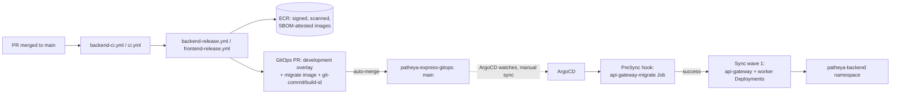

# Deployment guide (Phase 9 — Enterprise Workload Deployment)

How the complete Patheya Express stack actually gets from a merged PR to a running pod, entirely
through GitOps — the OBJECTIVE this phase exists to satisfy: "CI produces artifacts. ArgoCD deploys
them. No kubectl apply. No manual deployments."

## The full path, end to end

Nothing in this diagram is a human running `kubectl apply` or `helm install` — every arrow left of
"ArgoCD" is CI (`patheya-express-platform`/`frontend` repos, Phase 8); every arrow at or right of
it is GitOps (`patheya-express-gitops`, ArgoCD, Phase 6). This phase's own work sits almost entirely
in "what actually exists for CI to publish and ArgoCD to deploy" — the backend/frontend
application code, Kubernetes manifests, and the ExternalSecret wiring that makes a real deploy
possible, not a new deployment mechanism.

## What's deployed

| Workload | Kind | Namespace | Replicas (prod) | Notes |
| --- | --- | --- | --- | --- |
| `api-gateway` | Deployment | `patheya-backend` | 2+ (HPA) | HTTP + Socket.IO, `main.js` |
| `worker` | Deployment | `patheya-backend` | 2+ (HPA) | BullMQ processors only, `worker-main.js` (Phase 9) |
| `api-gateway-migrate` | Job (ArgoCD PreSync hook) | `patheya-backend` | 1 (run-to-completion) | `prisma migrate deploy`, `-migrate` image tag |
| `customer-app`/`restaurant-app`/`admin-app`/`delivery-app` | Deployment | `patheya-frontend` | 2-3+ (HPA) | Static Angular builds behind nginx |

## Manual sync is still required (deliberately)

Every ArgoCD `Application` this phase touches (`platform/{development,staging,production}/
{backend,frontend}-application.yaml`) stays on **manual sync** for staging/production; development
was flipped to `automated: {prune: true, selfHeal: true}` in this phase (see
[`docs/ci-cd/promotion-guide.md`](../ci-cd/promotion-guide.md)). A human (or, once trusted, a
future automation this phase deliberately doesn't build) still runs `argocd app sync
backend-staging`/`backend-production` after the promotion PR (`backend-promote.yml`/
`frontend-promote.yml`) merges — this phase's DO NOT IMPLEMENT list reserves "Application
deployment" automation beyond development for a later phase.

## First real deploy checklist

Before the first real `argocd app sync` against a live cluster:

1. Confirm `terraform apply` has actually run for the environment (Aurora/ElastiCache/EKS/
   ExternalSecrets/ArgoCD all need to exist first — this phase never ran `apply` itself, see the
   final report's readiness score).
2. Populate the four human-managed Secrets Manager entries
   (`patheya-express-terraform`'s `docs/secrets-guide.md`: `jwt-signing-key`, `cloudinary`,
   `razorpay`, `smtp`) — `backend-app-secrets` syncs an empty/incomplete Secret otherwise, and the
   app's env validation (`env.validation.ts`) will fail to boot on a missing `JWT_ACCESS_SECRET`.
3. Configure the CI secrets/variables `docs/ci-cd/ci-cd-guide.md` lists (ECR push role ARNs,
   `GITOPS_PR_TOKEN`, etc.) — no real image exists in ECR until `backend-release.yml`/
   `frontend-release.yml` actually run once.
4. Merge the first real GitOps PR, confirm `gitops-ci.yml` passes, then run the first
   `argocd app sync` by hand for whichever environment you're validating against.
5. Watch the migration Job (`kubectl logs job/api-gateway-migrate -n patheya-backend`) complete
   successfully before assuming the Deployment rollout that follows will actually work.

## Environment configuration

Per-environment differences live entirely in `k8s/overlays/{development,staging,production}/`
(this repo) and `infrastructure/kubernetes/overlays/*` (frontend repo) — replica counts, HPA
floors, Ingress hostnames, `NODE_ENV`/`STORAGE_DRIVER`. Nothing environment-specific is baked into
application code (`platform-standards.md` Section 6: "an app doesn't know or care which
environment it's in beyond its injected `NODE_ENV`").

## API integration (frontend → backend)

Frontend apps call the backend via its real Ingress host (`api.<env-prefix.>patheyaexpress.com`,
fixed from a `.example.com` placeholder in this phase — see the final report's risk list) baked
into each Angular app's environment file at build time (`environment.ts`/`.staging.ts`/`.prod.ts`)
— not a runtime-injected value, consistent with the frontend repo's own documented "no environment
variables read at container runtime" design. CORS on the backend side
(`CUSTOMER_APP_URL`/`RESTAURANT_APP_URL`/`ADMIN_APP_URL`/`DELIVERY_APP_URL`, `k8s/base/
kustomization.yaml`) must list the exact origin each frontend app is actually reachable at — fixed
in this phase to match the frontend repo's real Ingress hosts rather than the blueprint's
documented-but-unused naming example.
